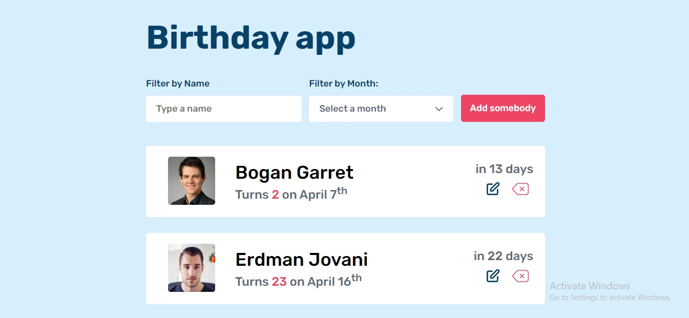

<h1 align="center">Birhday App</h1>

<div align="center">
  <h3>
    <a href="https://github.com/Betsimisaraka/birthday-app">
      Demo
    </a>
    <span> | </span>
    <a href="https://birthday-app-anita.netlify.app/">
      Solution
    </a>
  </h3>
</div>


In this project our goal is to display lists of people by fetching data from an url with people's birth date and their avatar. And calculating their birthday in this year whether it is already gone or still about to come. Then you can the people that has the nearest birthday date.

## Overview



You can see my demo by clicking this link with the username [Betsimisaraka](https://github.com/Betsimisaraka/birthday-app)

### Build with

-   [Vanilla Javascript](https://reactjs.org/)
-   [Html](https://html.org/)
-   [Css](https://css.org)

## Functionality

The functionality of this project are:

- I can see the lists of people with their avatar, date of birth and their birthday this year.
- I can delete a person from the list.
- I can edit a person's information
- I can add a new person to the lists
- I can filter the list by the people's firstname and lastname or by the month of the date of birth.
- I can reset the form.

## 1- Explaination about the structure of my project.
- First of all, I fetch the data from the people.json file then I store the result in the local storage.
- After that, I map through them and I put the data in the DOM.
- I worked on the date format to get the day, the month, the year of birth and the sooner birthday.
- Then, I get the edit and the delete work.
- After taht, I did the add person by clicking the add button and append the new person to the DOM.
- Lastly, I tried the new challenge to filter the name and the month.
## 2- Improvement

If I had more time I would have improved about the sort by the sooner birthday and the select the month using filter array method.

## 3- The new anythings that I learned while working on this project

Yes, absolutly. We didn't really work with date before but in this project we learn a lot about date format and age. Not only that but also I learn how to put the data into local storage after I fetch.

## 4- Challenging part
The most challenge part for me are these few things below:
- to put the data into the local storage,
- the date format,
- the sort by the birthday sooner,
- the select for month using filter.

## 5- A new explanation about a specific topic

Deffinetly, I want more expalanation about the things that I found the most challenging part. Including: 
- putting the data into the local storage,
- sort by the birthday sooner,
- select for month using filter.

## How to use

To clone and run this application, you'll need [Git](https://git-scm.com) and [Node.js](https://nodejs.org/en/download/) (which comes with [npm](http://npmjs.com)) installed on your computer. Or you can run this with a live server. From your command line: 

```bash
# Clone this repository
$ git clone https://github.com/Betsimisaraka/birthday-app

# Install dependencies
$ npm install

# Run the app
$ npm start
```

## Figma

Here is the link of the design in [Figma](https://www.figma.com/file/bb1Mie5R3mUhR77PtGG8bJ/Birthday-App?node-id=0%3A1)

## Contact

GitHub [Betsimisaka](https://{github.com/Betsimisaraka})
